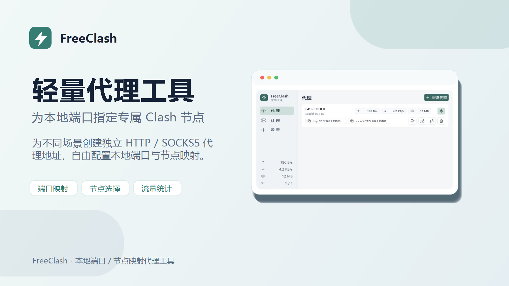

# FreeClash



这是一个自用项目，主要用于将不同代理节点映射到不同本地端口，方便按软件配置代理。
项目以个人使用为主，非必要不做长期维护。

例如：
- `127.0.0.1:19100` 固定走香港节点  -> Codex App 使用
- `127.0.0.1:19101` 固定走日本节点  -> 浏览器使用


Codex App / PowerShell 启动脚本参考
```shell
$env:HTTP_PROXY="http://127.0.0.1:19100"
$env:HTTPS_PROXY="http://127.0.0.1:19100"
$env:ALL_PROXY="http://127.0.0.1:19100"

$pkg = Get-AppxPackage -Name OpenAI.Codex
$codex = Join-Path $pkg.InstallLocation "app\Codex.exe"

Start-Process -FilePath $codex
```

浏览器 / Chrome 快捷方式参考

>把下面的内容追加填到快捷方式的“目标”中

>`--user-data-dir` 用于创建一个独立浏览器配置，避免和正在运行的默认 Chrome 冲突。


```shell
 --proxy-server=http://127.0.0.1:19101 --user-data-dir="%TEMP%\FreeClash-Chrome"
```
如果使用 SOCKS5 端口，可以改成：
```shell
 --proxy-server=socks5://127.0.0.1:19101 --user-data-dir="%TEMP%\FreeClash-Chrome"
```


## 开发

```shell
npm install
npm run build
npm run tauri:dev
```
